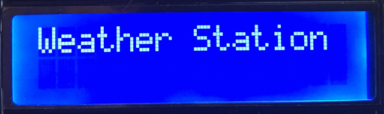
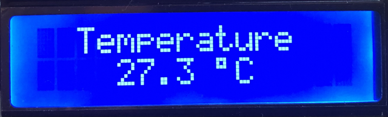

# Weather Station - PIC18 and the BMP180 sensor via I2C

This weather station project incorporates a PIC18 microcontroller, a Bosch BMP180 barometric pressure sensor, and a Hitachi HD44780 LCD. It demonstrates the implementation of two APIs to communicate with the sensor via I2C and the LCD via a 4-bit interface.

## Introduction

Atmospheric pressure, the force exerted by Earth's atmosphere on its surface, is crucial for weather prediction and altitude determination. It varies with altitude, with high pressure often indicating fair weather and low pressure signalling unsettled conditions, including storms. Meteorologists use pressure patterns to forecast weather changes. Additionally, atmospheric pressure is employed in altimeters to calculate altitude, making it vital for aviation and outdoor activities like hiking and climbing, where accurate elevation measurement is essential for safety and navigation.

## Description

This project aimed to implement two Application Programming Interfaces (APIs) on a PIC18F47Q10 microcontroller, one to communicate with the Bosch BMP180 barometric pressure sensor via I2C and the other to interface a Hitachi HD44780 LCD. Unlike the Arduino community with its ubiquitous libraries, Microchip did not offer any APIs for PIC18 (8-bit) controllers to interface with this BMP180 barometric pressure sensor and the LCD at the time of writing.

The BMP180 sensor API comprises functions to initialise the sensor, read the uncompensated (raw) temperature and pressure values from the sensor via I2C and additional algorithms to calculate the true temperature and pressure based on these raw data values. Under the hood, it utilises the I2C drivers of Microchip's Foundation Service to ensure code portability between the 8-bit MCU family.

The HD44780 LCD API interfaces the LCD using only four data pins instead of eight, thus saving precious GPIO ports. Therefore, it transmits one data byte as two sequential 4-bit (nibble) transfers, resulting in a slightly lower but not noticeable data transmission rate. This API provides functionality such as an initialisation routine, shifting the cursor or display to the left and right, and printing characters, strings, and integer values. The wiring between the LCD pins and the MCU's GPIO ports is defined in the header file to ensure portability.

A finite state machine based on function pointers realises the internal device state, aiming to increase the overall maintainability of the project.

## Device Operation

The LCD menu is split into five screens, showing a welcome message, the current temperature, atmospheric pressure and altitude, and the weather trend. While the welcoming screen is shown once after power is switched on, the other screens rotate in a three-second interval.

After successfully initialising the communication with the barometric pressure sensor and the LCD, a welcome message is displayed, as indicated below, shifting slowly from the right to the left of the display. In case of failing to establish communication with the sensor, an error message will be shown instead.

    

Next, the current temperature is displayed as shown below. Despite displaying it with one decimal place, no float arithmetic was used for calculating the temperature. Instead, integer arithmetic and a function that prints an integer as a float value were implemented.

    

### Temperature

### Atmospheric Pressure

### Altitude

### Weather Trend

## Software Used

## Hardware Used

