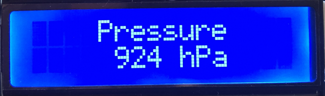
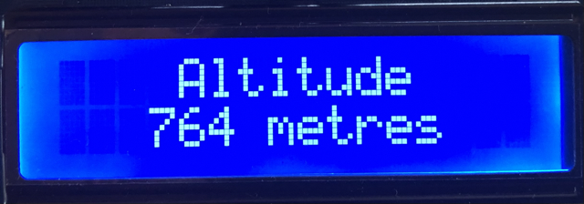
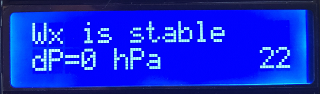
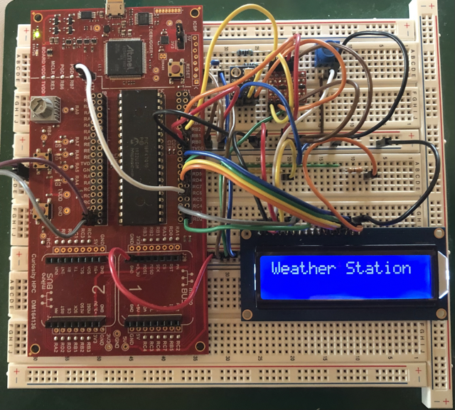

# Weather Station - PIC18 and the BMP180 sensor via I2C

This weather station project incorporates a PIC18 microcontroller, a Bosch BMP180 barometric pressure sensor, and a Hitachi HD44780 LCD. It demonstrates the implementation of two APIs to communicate with the sensor via I2C and the LCD via a 4-bit interface.

## Introduction

Atmospheric pressure, the force exerted by Earth's atmosphere on its surface, is crucial for weather prediction and altitude determination. It varies with altitude, with high pressure often indicating fair weather and low pressure signalling unsettled conditions, including storms. Meteorologists use pressure patterns to forecast weather changes. Additionally, atmospheric pressure is employed in altimeters to calculate altitude, making it vital for aviation and outdoor activities like hiking and climbing, where accurate elevation measurement is essential for safety and navigation.

## Description

This project aimed to implement two Application Programming Interfaces (APIs) on a PIC18F47Q10 microcontroller, one to communicate with the Bosch BMP180 barometric pressure sensor via I2C and the other to interface a Hitachi HD44780 LCD. Unlike the Arduino community with its ubiquitous libraries, Microchip did not offer any APIs for PIC18 (8-bit) controllers to interface with this BMP180 barometric pressure sensor and the LCD at the time of writing.

The BMP180 sensor API comprises functionality to initialise the sensor, read the uncompensated (raw) temperature and pressure values from the sensor via I2C and additional algorithms to calculate the true temperature and pressure based on these raw data values. Under the hood, it utilises the I2C drivers of Microchip's Foundation Service to ensure code portability between the 8-bit MCU family.

The HD44780 LCD API interfaces the LCD using only four data pins instead of eight, thus saving precious GPIO ports. Therefore, it transmits one data byte as two sequential 4-bit (nibble) transfers, resulting in a slightly lower but not noticeable data transmission rate. This API provides functionality such as an initialisation routine, shifting the cursor or display to the left and right, and printing characters, strings, and integer values. The wiring between the LCD pins and the MCU's GPIO ports is defined in the header file to ensure portability.

A finite state machine based on function pointers realises the internal device state, aiming to increase the overall maintainability of the project.

## Device Operation

The LCD menu is split into five screens, showing a welcome message, the current temperature, atmospheric pressure and altitude, and the weather trend. While the welcoming screen is shown once after power is switched on, the other screens rotate in a three-second interval. Another feature is the dimmable LCD backlight, where the potentiometer for dimming is located on the Curiosity HPC board, using peripherals such as Analogue-Digital Conversion (ADC) and Puls-Width-Modulation (PWM).

After successfully initialising the communication with the barometric pressure sensor and the LCD, a welcome message is displayed, as indicated below, shifting slowly from the right to the left of the display. In case of failing to establish communication with the sensor, an error message will be shown instead.

    

Next, the current temperature is displayed as shown below. Despite displaying it with one decimal place, no float arithmetic was used for calculating the temperature. Instead, integer arithmetic and a function that prints the temperature (int) as a float value were implemented.

    

As depicted in the screen below, the atmospheric pressure is displayed in hectopascal, whereas internally, the pressure is calculated in Pa (1 hPa = 100 Pa) to increase the accuracy when using integer arithmetic. The equivalent to 1 hPa is one millibar, the metric unit of pressure.

    

The screen shown below indicates the calculated altitude in metres. Altitude can be derived from atmospheric pressure using the barometric formula based on the principle that atmospheric pressure decreases with increasing altitude. By measuring the current atmospheric pressure at a specific location and comparing it to a reference pressure (usually the standard atmospheric pressure at sea level), altitude above sea level can be calculated. However, weather changes, such as shifts in atmospheric pressure due to incoming weather systems or temperature changes, can influence the accuracy of this method. Sudden and significant changes in atmospheric pressure can result in inaccurate altitude calculations.

    

Finally, the device indicates the weather trend, as shown in the screen below. Depending on the atmospheric pressure change over time, the LCD either displays the trend as "Wx is improving", "Wx is stable", or "Wx is worsening", where "Wx" is the abbreviation for the weather. A so-called moving average algorithm was utilised to filter out potential fluctuations in the pressure readings. Every minute, a new pressure reading is added to a FIFO to determine the moving average pressure. In total, the FIFO can hold up to 120 pressure readings. The delta pressure is indicated in the second line on the left, and the figure to the right indicates the number of collected pressure readings used to calculate the delta pressure value.

    

## Software Used

- MPLAB® X IDE 6.10 [(microchip.com/mplab/mplab-x-ide)](http://www.microchip.com/mplab/mplab-x-ide)
- MPLAB® XC8 2.41 [(microchip.com/mplab/compilers)](http://www.microchip.com/mplab/compilers)
- MPLAB® Code Configurator (MCC) 5.3.7 [(microchip.com/mplab/mplab-code-configurator)](https://www.microchip.com/mplab/mplab-code-configurator)
- MPLAB® Code Configurator (MCC) Device Libraries PIC10 / PIC12 / PIC16 / PIC18 MCUs [(microchip.com/mplab/mplab-code-configurator)](https://www.microchip.com/mplab/mplab-code-configurator)

## Hardware Used

- Microchip Curiosity HPC board with a PIC18F47Q10 MCU
- Hitachi HD44780 LCD (16 x 2 lines)
- Bosch BMP180 barometric pressure sensor

    

